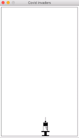

# Covid-invaders

I developed this project as an attempt to learn more about functional programming and while going through the How To Design Programs [(HTDP)](https://htdp.org/2019-02-24/index.html) book and the How to Code: Simple Data edx course by Gregor Kiczales which is based on the same book.

I changed the code a bit to make it work with Racket instead of the Beginning Student Language, and my plan is to keep working on it as I learn more things about Racket.

## How to play

  

Press left, right to move the vaccine and space to fire a shot ;) When a virus hits the ground it's game over amigo.

### Build from scratch
Build dependencies with `raco pkg install`

Then run `raco exe --ico icons/logo_ico.ico --icns icons/logo_ico.icns --gui covid-invaders.rkt` to generate an executable for you.

### Run with Racket
Execute `racket covid-invaders.rkt` from the command line.
